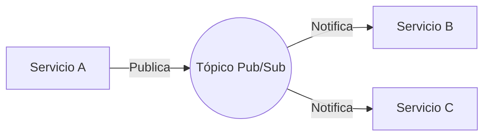

# Comunicación entre Servicios

En un sistema distribuido, la forma en que los servicios interactúan determina la resiliencia y el acoplamiento de la plataforma. Utilizamos una combinación de patrones síncronos y asíncronos.

---

## 1. Comunicación Asíncrona (Event-Driven)

Es el mecanismo **predominante** para la integración entre módulos. Utilizamos **Google Cloud Pub/Sub**.

### El Patrón de Eventos

Un microservicio publica un "evento de negocio" cuando ocurre algo significativo. Otros servicios se suscriben para reaccionar a él.

**Ejemplos de Eventos**:

- `OrdenConfirmada`
- `UsuarioRegistrado`
- `PagoProcesado`

**Ventajas**:

- **Resiliencia**: Si el suscriptor está caído, el mensaje se retiene en la cola.
- **Escalabilidad**: Múltiples suscriptores pueden procesar eventos en paralelo.
- **Desacoplamiento**: El emisor no sabe quién recibe el mensaje.

---

## 2. Comunicación Síncrona (REST / gRPC)

Se utiliza solo para operaciones que requieren una respuesta inmediata.

### REST APIs (FastAPI + Apigee)

Es el estándar para la comunicación entre el Frontend y el Backend, y para consultas simples entre servicios.

- **Apigee**: Actúa como API Gateway centralizando la seguridad (OAuth2/JWT), cuotas y analíticas.
- **Validación**: Todas las entradas se validan estrictamente con Pydantic.

### gRPC (Opcional)

Para comunicaciones internas de muy alto rendimiento y baja latencia donde el tipado estricto (Protobuf) es una ventaja.

---

## 3. Patrones de Resiliencia

Todas las interacciones síncronas deben implementar mecanismos de defensa:

### Retries (Reintentos)

Reintentar automáticamente peticiones fallidas debido a errores transitorios de red, utilizando **Backoff Exponencial**.

### Timeouts

Nunca esperar indefinidamente una respuesta. Cada llamada debe tener un tiempo máximo de espera definido.

### Circuit Breaker

Si un servicio destino está fallando sistemáticamente, el "circuito se abre" y las llamadas fallan inmediatamente sin intentar conectar, permitiendo que el servicio destino se recupere.

---

## 4. Gestión de APIs con Apigee

Ninguna API de backend se expone directamente a internet. Todas pasan por Apigee para:

| Función           | Descripción                                                           |
| :---------------- | :-------------------------------------------------------------------- |
| **Seguridad**     | Validación de tokens JWT y protección contra amenazas web.            |
| **Rate Limiting** | Evitar saturación de servicios mediante cuotas por cliente.           |
| **Monitoreo**     | Visibilidad completa de latencias y tasas de error.                   |
| **Abstracción**   | Permite cambiar la implementación del backend sin afectar al cliente. |

---

### Temas Relacionados

- [Principios de Diseño](./principios)
- [Despliegue en GCP](/docs/devops/gcp)
