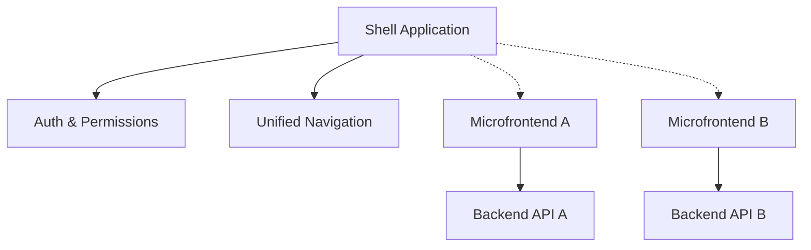

# Arquitectura de Microfrontends

Adoptamos una arquitectura de Microfrontends basada en **Module Federation** para permitir el desarrollo y despliegue independiente de diferentes módulos funcionales.

---

## 1. Conceptos Fundamentales

### Module Federation (Vite)

Permite que aplicaciones JavaScript carguen código de otras aplicaciones en tiempo de ejecución de forma eficiente, compartiendo dependencias comunes para evitar duplicación.

### Componentes de la Arquitectura

1.  **Host (Shell)**: La aplicación principal que orquesta la navegación, autenticación y carga los remotos.
2.  **Remotes (Microfrontends)**: Aplicaciones independientes que exponen componentes o páginas específicas (ej. Módulo de Catálogos, Módulo de Inventario).
3.  **Shared Dependencies**: Librerías comunes (React, MUI, Axios) que se cargan una sola vez.

---

## 2. Estructura del Sistema

---

## 3. Comunicación entre Microfrontends

Evitamos el acoplamiento directo entre remotos. La comunicación ocurre a través del Shell:

### Window Object / Context Global

El Shell expone un contexto global en `window` para datos compartidos (ej. token de autenticación, ubicación seleccionada).

### Eventos Personalizados (CustomEvents)

Utilizamos el bus de eventos del navegador para comunicación asíncrona:

- El Shell dispara un evento `location-changed`.
- Los Microfrontends escuchan y actualizan su estado local.

---

## 4. Ventajas de este Enfoque

- **Despliegue Independiente**: Podemos actualizar un módulo sin tocar el Shell.
- **Tecnologías Flexibles**: Diferentes equipos pueden usar versiones distintas de librerías si es necesario (aunque se desaconseja).
- **Escalabilidad del Equipo**: Los equipos trabajan en repositorios separados, reduciendo conflictos de código.

---

### Temas Relacionados

- [Configuración Unificada](./configuracion)
- [Sistema de Permisos](./permisos)
